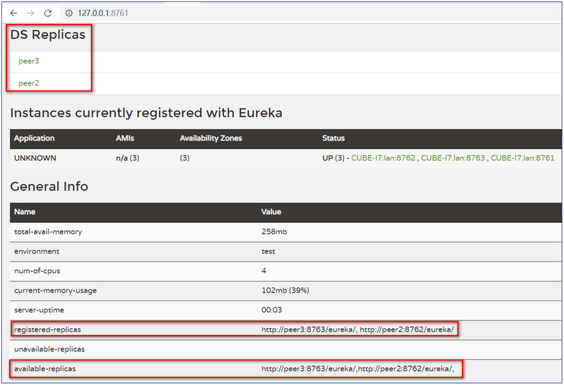

# spring-cloud-examples

# 参考：
1. 慕课网 Spring Cloud 廖师兄
2. http://www.ityouknow.com/,  https://github.com/ityouknow/spring-cloud-examples
3. 《史上最简单的Spring Cloud教程源码》 https://github.com/yafey/SpringCloudLearning
  - [史上最简单的 SpringCloud 教程 | 第一篇: 服务的注册与发现（Eureka）(Finchley版本)](http://blog.csdn.net/forezp/article/details/81040925)
  - [史上最简单的SpringCloud教程 | 第十篇: 高可用的服务注册中心(Finchley版本)](http://blog.csdn.net/forezp/article/details/81041101)

# 说明
Spring Boot版本2.1.6.RELEASE,Spring Cloud版本为Greenwich.SR1。
这个pom文件作为父pom文件，起到依赖版本控制的作用，其他module工程继承该pom。这一系列文章全部采用这种模式，其他文章的pom跟这个pom一样。再次说明一下，以后不再重复引入。


# Eureka 模块说明
> 精简自 ： [史上最简单的 SpringCloud 教程 | 第一篇： 服务的注册与发现Eureka(Finchley版本)](https://blog.csdn.net/forezp/article/details/81040925)


## 创建 eureka-server 步骤

1. Spring Initializer -> Cloud Discovery -> eureka server.
2. 修改 parent 继承自 `sc-1-eureka` ， 并引入 `spring-cloud-starter-netflix-eureka-server` 的依赖。
3. 启动一个 服务注册中心 ： **启动类上添加 `@EnableEurekaServer` 注解**。
4. eureka是一个高可用的组件，它没有后端缓存，每一个实例注册之后需要向注册中心发送心跳（因此可以在内存中完成），在默认情况下erureka server也是一个eureka client ,必须要指定一个 server。修改/创建 eureka server的配置文件appication.yml 
   - 启动报错： 添加 `eureka.client.serviceUrl.defaultZone` 属性 (serviceUrl 是个Map), 默认的 defaultZone 为`DEFAULT_URL  = "http://localhost:8761/eureka/"` 。 详见 ： EurekaClientConfigBean.java
     - 修改端口为 8761.
   - `UNKNOWN` --> 添加 `spring.application.name`
   - 不把自己当做 eureka-client 端， 添加 `eureka.client.registerWithEureka=false` ， `eureka.client.fetchRegistry=false`
   - client 不停重启 会出现红色警告。（心跳机制，一段时间内，client 如果不在线的次数达到某个比例，会警告，但是假装他还在线。）
     - (Optional) **开发环境 可以 设置**   `eureka.server.enable-self-preservation=false` , 生产环境不要这么做。 （会换成另一个警告，表示自我保护机制被关掉了，告诉不要这么做。）
5. eureka server 是有界面的，启动工程,打开浏览器访问：http://127.0.0.1:8761/ 。
6. mac 下 后台运行 ： `nohup java -jar target/eureka-server-xxx.jar >/dev/null 2>&1 &`
   - 结束进程 `kill -9 <pid>`


## 创建 Eureka Client 步骤

1. 创建过程同 server 类似，也可以创建成 Maven Moudle ， pom 文件与 server 类似，不同的是 dependency 从 `spring-cloud-starter-netflix-eureka-server` 改成了 `spring-cloud-starter-netflix-eureka-client` (即 从 server 改成了 client)。
2. 配置 注册中心地址： `eureka.client.serviceUrl.defaultZone=http://127.0.0.1:8761/eureka/`
3. 添加一个 client ： **启动类上添加 `@EnableDiscoveryClient` 注解**。(注意与 server 端的区别)
4. client 的配置：
   - `UNKNOWN` --> 添加 `spring.application.name`
   - (Optional) client 的 status 处自定义链接：配置 `eureka.instance.hostname` 。
   - client 不停重启 , eureka 会出现红色警告，见 server 端的配置 （关掉自我保护）。


## 高可用 Eureka 注册中心（集群）

> （省略 双节点注册中心 的说明，和下面的类似 , yml 配置中只需要互相指向即可）。
>
> > Eureka 集群过程中， **defaultZone 不用配置成 ip 的形式** , 会遇到各种暂时无解的问题（如， 启动 3 个注册中心时 ，DS Replicas 里面只会显示 一个 127.0.0.1 ； 同时不能将 registerWithEureka 和 registerWithEureka 设置为 false ， 不然 available-replicas 里面没有节点。）， 还是先按官方的 示例来吧。

大于等于三台的注册服务中心来保证稳定性，配置时只需要将某台注册中心的指向其它的注册中心。

- 从可维护性的角度，使用 spring boot profile 的方式，而不是直接说用 `--` 参数的方式。


具体步骤：

1. 创建 application.yml ， 使用 `---` 区分不同的 profile。

   1. （profile）peer1 服务中心的配置， 将 serviceUrl 指向 **peer2 和 peer3** .
   2. peer2 将 serviceUrl 指向 **peer1 和 peer3** .
   3. peer3 将 serviceUrl 指向 **peer1 和 peer2** .

2. host 转换 （参考 modify_hosts.bat，双击就可完成修改）

   在hosts文件中加入如下配置 (`C:\WINDOWS\system32\drivers\etc\hosts`)

   ```
   127.0.0.1 peer1  
   127.0.0.1 peer2  
   ```

3. 打包启动

   依次执行下面命令

   ```
   #打包
   mvn clean package
   # 分别以 peer1 、 peeer2 和 peer3 配置信息启动 eureka
   java -jar eureka-cluster-server-0.0.1-SNAPSHOT.jar --spring.profiles.active=peer1
   java -jar eureka-cluster-server-0.0.1-SNAPSHOT.jar --spring.profiles.active=peer2
   java -jar eureka-cluster-server-0.0.1-SNAPSHOT.jar --spring.profiles.active=peer3
   ```

4. 依次启动完成后，浏览器输入：`http://localhost:8761/` 效果图如下：

   根据图可以看出 peer1 的注册中心 DS Replicas 已经有了 peer2 的相关配置信息，并且出现在 available-replicas 中。我们手动停止 peer2 来观察，发现 peer2 就会移动到 unavailable-replicas 一栏中，表示 peer2 不可用。

   

   > 个人感受：这是通过看官方文档的写的demo ，但是需要手动改host是不是不符合Spring Cloud 的高上大？
   >
   > > 摘自官网 [high_availability_zones](http://projects.spring.io/spring-cloud/spring-cloud.html#_high_availability_zones_and_regions)
   > >
   > > 官网的例子里面说 ， 修改 hosts 这种方式 只是为了在本地进行 eureka 的 功能性测试， 实际生产上不需要这么做。
   > >
   > > (there’s not much value in doing that in production) by manipulating `/etc/hosts` to resolve the host names. In fact, the `eureka.instance.hostname` is not needed if you are running on a machine that knows its own hostname (it is looked up using `java.net.InetAddress` by default).
   > >
   > > 
   > >
   > > **Prefer IP Address**
   > > In some cases, it is preferable for Eureka to advertise the IP Adresses of services rather than the hostname. Set eureka.instance.preferIpAddress to true and when the application registers with eureka, it will use its IP Address rather than its hostname.
   > >
   > > eureka.instance.preferIpAddress=true是通过设置ip让eureka让其他服务注册它。也许能通过去改变去通过改变host的方式。


   附 ： application.yml  内容 ， 参考自 Spring Cloud 官方示例。

   ```yaml
   ---
   spring:
      profiles: peer1
   server:
      port: 8761
   eureka:
      instance:
         hostname: peer1
      client:
        serviceUrl:
          defaultZone: http://peer2:8762/eureka/,http://peer3:8763/eureka/
   
   ---
   spring:
      profiles: peer2
   server:
      port: 8762
   eureka:
      instance:
         hostname: peer2
      client:
       serviceUrl:
         defaultZone: http://peer2:8762/eureka/,http://peer3:8763/eureka/
   
   ---
   spring:
      profiles: peer3
   server:
      port: 8763
   eureka:
      instance:
         hostname: peer3
      client:
        serviceUrl:
          defaultZone: http://peer1:8761/eureka/,http://peer2:8762/eureka/
   ```

   #### Eureka client 向 Eureka 集群 注册

   > 虽然 client 可以只向一台 server 注册， 另外几台 server 也能获取到 client 的信息， 但是不够稳妥，最好还是将 client 向多台 server 注册。

   和 原先 Eureka client 没什么区别， 此处只是将 client 分别向 3 个 eureka server 同时注册。

   使用偷懒的方式，通过 传递 参数 重新配置 defaultZone 。

   依次执行下面的命令， 然后 访问 `http://localhost:8763/` ， 可以看到 client 已经注册上去了。

   ```
   #打包
   mvn clean package
   # 分别以 peer1 、 peeer2 和 peer3 配置信息启动 eureka
   java -jar eureka-client-0.0.1-SNAPSHOT.jar --eureka.client.serviceUrl.defaultZone=http://peer1:8761/eureka/,http://peer2:8762/eureka/,http://peer3:8763/eureka/
   ```

   

